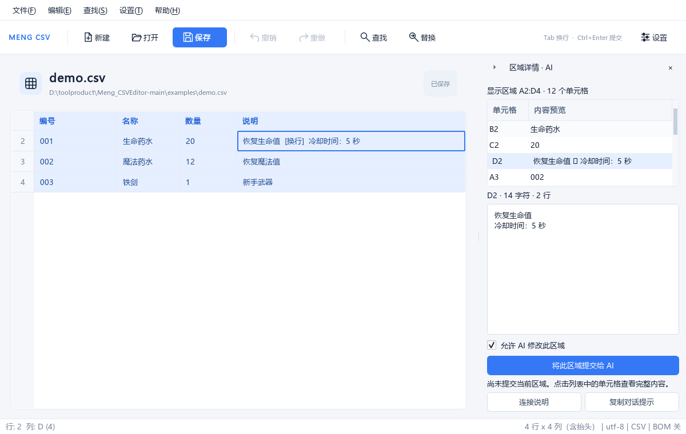

# Meng_CSVEditor

用 PyQt5 编写的轻量 CSV / TSV 编辑器，适合游戏配置表及日常表格数据编辑。

从 [Release 下载最新版](https://github.com/Eb-Ling/Meng_CSVEditor/releases/latest)。推荐下载 `Meng_CSVEditor_with_MCP.zip`，内含编辑器、MCP 程序、配置模板和示例 CSV；解压后保持两个 EXE 在同一个文件夹。使用方法见下方“区域详情与 AI”及“小白 MCP 配置”教程。



## 源码核验

本目录原本保留的三个 Python 文件已与原始 `Meng_CSVEditor.exe` 核验：使用相同的 Python 3.13.9 编译，三个模块共 127 个代码对象完全一致。详情和原始 EXE 哈希见 [核验报告](recovery/RECOVERY_REPORT.md)。

- `recovery/existing-source/` 保存改进前的原始源码。
- 项目根目录的 `csv_editor.py`、`csv_model.py`、`csv_commands.py` 是本轮改进版。
- 原始 EXE 可从 [v1.0.0 Release](https://github.com/Eb-Ling/Meng_CSVEditor/releases/tag/v1.0.0) 下载；新构建输出为 `dist/Meng_CSVEditor.exe`。

## 功能及本轮改进

- 网格编辑、多行单元格、行列插入删除、查找替换、最近文件。
- 清爽的浅色工作台：图标工具栏、文件标题与保存状态、柔和的选中高亮、细网格和交替行底色。小窗口自动简化布局，支持高 DPI 显示；保存设置、查找替换窗口使用一致的样式。
- 长内容在表格中使用简洁预览，悬停可查看内容，双击进入完整的多行编辑。
- 保存前提交正在编辑的单元格；保存失败或取消另存为时，继续保留当前文档和未保存状态。
- 保存使用同目录临时文件，完成写入后替换目标文件，避免写入失败把原文件截断。
- “全部替换”支持仅当前列，并作为一次可撤销操作；不再错误清除未保存标记。
- 删除行列、粘贴增加行列均可完整撤销，空表也能重新插入行列。
- CSV 的第一行显示为顶部抬头，右键选择“编辑抬头”可修改，支持多行文字、撤销重做并随文件保存。正文从 CSV 第 2 行开始显示，行号与文件记录编号一致，第一行不会重复显示或重复保存。
- 已取消排序，点击抬头不会重排行；复制、粘贴、查找按文件原顺序操作。拖动列标题仍仅改变显示位置，保存保留原列序。
- 剪贴板使用带引号的 TSV，正确处理单元格里的 Tab、引号和换行，支持移动列标题后的复制粘贴。
- 自动识别常见分隔符及 UTF-8、GBK / GB18030 等编码；能够打开带 UTF-8 / UTF-16 / UTF-32 BOM 的文件。
- 在“设置 → 保存设置...”中切换“保存时写入 BOM”，默认关闭，并记住选择。保存和另存为均使用这个设置；状态栏显示开关、编码和分隔符。
- 关闭 BOM 时，带 BOM 的 UTF-8 保存为普通 UTF-8，UTF-16 / UTF-32 保存为 UTF-8 无 BOM。开启时，UTF-8 / UTF-16 / UTF-32 写入对应 BOM，UTF-16 / UTF-32 保留原字节序；GBK / GB18030 不添加 BOM。保留记录换行符、末尾换行状态及各行实际字段数量。
- 编辑器随文本扩展，限制在表格可见区域内，超长内容可滚动；退出编辑恢复行高。
- 右键选区打开可折叠的“区域详情 · AI”侧栏，逐格查看全文；提交后通过 MCP 让 AI 阅读、讲解及可撤销地修改该区域。
- 边界审查补强了损坏设置、过期编辑器、无效模型参数、撤销命令及保存失败处理；未捕获的 Python 回调异常会显示错误窗口并记录本地日志。覆盖范围及实际限制见 [边界审查报告](BOUNDARY_AUDIT.md)。

分隔符和无 BOM 编码的识别使用规则推断，打开后可在状态栏检查结果。混合记录换行符会统一为检测到的主要格式；CSV 引号样式可能规范化，数据内容保持不变。另存为 `.csv` 使用逗号，另存为 `.tsv` 使用 Tab。GBK / GB18030 沿用原编码；Unicode 文件按上述规则保存为无 BOM 格式。

## 快捷键

| 快捷键 | 操作 |
| --- | --- |
| `Ctrl+N` / `Ctrl+O` | 新建 / 打开 |
| `Ctrl+S` / `Ctrl+Shift+S` | 保存 / 另存为 |
| `Ctrl+Z` / `Ctrl+Y` | 撤销 / 重做 |
| `Ctrl+C` / `Ctrl+X` / `Ctrl+V` | 复制 / 剪切 / 粘贴 |
| `Ctrl+F` / `Ctrl+H` | 查找 / 替换 |
| `Ctrl+I` / `Ctrl+Shift+I` | 在上方 / 下方插入行 |
| `Ctrl+J` / `Ctrl+Shift+J` | 在左侧 / 右侧插入列 |
| `Tab`（单元格编辑中） | 插入换行 |
| `Ctrl+Enter` / `Esc`（编辑中） | 提交 / 取消单元格编辑 |

## 区域详情与 AI：先这样使用

1. 打开 `Meng_CSVEditor.exe`，打开自己的 CSV，或试用 `examples/demo.csv`。
2. 拖选单元格，右键选择 **“查看区域详情 / 提交给 AI”**。右侧会出现区域面板。
3. 点面板列表里的单元格，下方会显示完整文字、空格和换行。顶部箭头可折叠或展开，`×` 可关闭面板。
4. 按下面的教程为 AI 客户端配置一次 MCP，然后点击 **“将此区域提交给 AI”**。
5. 去已连接的 AI 客户端提问，例如：**“请使用 meng_csv_editor MCP 读取我最后提交的区域，给初学者解释每个字段的含义，先不要修改。”**
6. 要修改时，例如：**“把区域里的编号补成三位，保留前导零；只改我提交的区域。”** 修改会出现在表格里，可以 `Ctrl+Z` 撤销，确认后由你保存 CSV。

第一行抬头也是真实的 CSV 数据。右键抬头可选择“编辑抬头（CSV 第一行）”，也可选择“查看此抬头详情 / 提交给 AI”来单独提交该抬头。正文的粘贴、删除行及查找替换只操作正文，不会覆盖或删除抬头；插入和删除列会同时处理该列的抬头。空抬头显示为“（空抬头）”，保存仍保留真实空值，允许重名。只有抬头的文件可继续插入正文行；空文件不会在打开时自动增加记录。

取消勾选“允许 AI 修改此区域”即可切换为只读。查看侧栏本身不会提交数据；点击提交后，区域内容才会提供给连接的 AI 客户端。提交不会自动创建一段聊天，AI 客户端在对话中调用 MCP 工具时读取信息。

**最后一次提交替换前一次提交。** 只提供明确选中的单元格，不会把选区外包矩形中未选中的格子一起提交。多个编辑器窗口共用最后一次提交。写回会核对区域编号、版本及原内容；手工改过、撤销/重做、切换文件或删除原格子后，遇到冲突时重新选择并提交，再让 AI 读取。

一次最多提交 5000 个单元格、4 MiB 文字。长单元格通过分页工具读取全文。关闭编辑器后仍能阅读最后提交的信息；修改需要编辑器保持打开且原区域有效。缓存位于本机用户的 `%LOCALAPPDATA%/Meng_CSVEditor/mcp/`，不会写进项目或 Git 仓库。

## MCP 配置：第一次使用也能照着填

### 先准备两个程序

解压 `Meng_CSVEditor_with_MCP.zip`，把两个 EXE 放在同一个文件夹。例如你选择 `D:/CSV工具/`：

```text
D:/CSV工具/Meng_CSVEditor.exe       ← 日常打开的编辑器
D:/CSV工具/Meng_CSVEditor_MCP.exe   ← 由 AI 客户端启动的 MCP 程序
```

下面的 `D:/CSV工具/` **必须替换成自己电脑上实际的完整路径**，保留最后的 `Meng_CSVEditor_MCP.exe` 文件名。路径可以有空格；客户端的路径输入框里不要额外输入引号。

- `command`：运行哪个程序。本项目填 **MCP EXE** 的完整路径。
- `args`：启动参数。EXE 版填空数组 `[]`。
- 连接类型：选择 **STDIO**。本项目不需要远程网址，也不需要在编辑器里填写模型 API Key。

可以优先点击侧栏的 **“连接说明 → 选择客户端 → 复制配置”**，它会生成符合当前软件位置的内容。模型账号与对话费用由你选择的 AI 客户端管理。

### Codex

用户配置文件通常在 `C:/Users/你的用户名/.codex/config.toml`。在文件末尾添加下面一段，保留原有内容。如果已经有同名的 `[mcp_servers.meng_csv_editor]`，更新这一段，避免重复添加。

```toml
[mcp_servers.meng_csv_editor]
command = "D:/CSV工具/Meng_CSVEditor_MCP.exe"
args = []
startup_timeout_sec = 30
tool_timeout_sec = 30
```

使用 Codex CLI 时也可以运行：

```powershell
codex mcp add meng_csv_editor -- "D:/CSV工具/Meng_CSVEditor_MCP.exe"
codex mcp list
```

在客户端的 MCP 设置页面添加时，名称填 `meng_csv_editor`，类型选 STDIO，程序路径填上面的 `command`，参数留空。保存后重新连接 MCP；当前会话尚未出现新工具时，新建会话或重启客户端再试。具体入口以安装版本为准。参见 [Codex 官方 MCP 说明](https://learn.chatgpt.com/docs/extend/mcp?surface=cli)。

### Claude Desktop

在 Windows 文件资源管理器地址栏输入 `%APPDATA%/Claude/`，找到或创建 `claude_desktop_config.json`。也可在 Claude Desktop 开发者设置中打开配置文件。

新文件可以填写完整的以下 JSON。已有配置时，只将 `meng_csv_editor` 这一项合并到原来的 `mcpServers` 中，保留其他服务器和设置。

```json
{
  "mcpServers": {
    "meng_csv_editor": {
      "command": "D:/CSV工具/Meng_CSVEditor_MCP.exe",
      "args": []
    }
  }
}
```

JSON 使用英文双引号，最后一项后面不要加逗号。示例使用 `/`，可以避免反斜杠转义问题。完全退出再启动 Claude Desktop，在 MCP 工具列表中确认服务器已连接。参见 [官方本机 MCP 接入教程](https://modelcontextprotocol.io/docs/develop/connect-local-servers)。

Claude Code 用户也可将同样的 `mcpServers` JSON 合并到项目的 `.mcp.json`；`examples/mcp-generic.json` 可作为模板。首次使用项目配置时，按客户端提示启用服务器，参见 [Claude Code 官方 MCP 说明](https://code.claude.com/docs/en/mcp)。不同客户端的配置文件名和启用步骤以该客户端说明为准。

### 通用 Agent 或其他客户端

添加本地 STDIO 服务器，名称填 `meng_csv_editor`，启动程序填 MCP EXE 的完整路径，参数为空。常见的 `mcpServers` JSON 模板见 `examples/mcp-generic.json`。部分客户端要求 `servers` 等外层字段，请使用它要求的外层结构，内部的启动程序和参数相同。

自己开发 Agent 时可参考 `examples/agent_client.py`。它使用官方 MCP SDK，通过 stdio 分页读取最后提交的区域和长单元格全文，无需依赖 Codex 或 Claude：

```powershell
# 先运行编辑器并提交区域，再运行读取示例
.\.venv\Scripts\python.exe examples/agent_client.py
# 或连接已打包的 MCP 程序
.\.venv\Scripts\python.exe examples/agent_client.py --exe "D:/CSV工具/Meng_CSVEditor_MCP.exe"
```

服务器提供三个工具：`get_latest_region` 读取最后提交区域；`get_cell_details` 分页读取某格全文；`apply_region_edits` 使用 `cell_id`、最新 `revision` 和旧值 `sha256` 写回。还有 `csv-editor://latest` 资源和 `explain_region` 讲解提示。本方案连接本机进程；网页聊天产品需要它自己支持的连接方式，不能仅靠填写本机路径接入。

### 源码运行及配置生成

源码用户先安装 `requirements.txt`。以下命令把适合自己电脑的配置生成到 `local-mcp-configs/`：

```powershell
.\.venv\Scripts\python.exe configure_mcp.py
# 为已打包的程序生成配置
.\.venv\Scripts\python.exe configure_mcp.py --exe-dir "D:/CSV工具"
```

源码模式的 `command` 是项目虚拟环境的 `python.exe`，`args` 是 `mcp_server.py` 的完整路径，程序会自动填好。自动合并 Claude 配置时使用 `--claude-config`；已有文件会先备份，其他服务器会保留：

```powershell
.\.venv\Scripts\python.exe configure_mcp.py --exe-dir "D:/CSV工具" --claude-config "$env:APPDATA/Claude/claude_desktop_config.json"
```

### 连接不上时按顺序检查

1. 配置指向真实存在的 `Meng_CSVEditor_MCP.exe`，不要误填 GUI EXE。
2. 使用完整路径；移动文件夹后更新配置。
3. JSON/TOML 格式正确，没有重复服务器；源码模式先安装依赖。
4. 重新连接 MCP 或重启客户端，工具列表应出现上述三个工具。
5. 在编辑器中点击提交，并明确要求 AI 用 `meng_csv_editor MCP` 读取最后区域。
6. “区域已变化”时重新提交；“仅允许阅读”时按需开启侧栏写入选项。修改可撤销，CSV 仍由你保存。

启动自检命令是 `Meng_CSVEditor_MCP.exe --check`。直接双击 MCP EXE 不会出现表格窗口，属于正常情况。

## 运行源码

需要 Python 3.10 或更新版本。改进版在 Windows、Python 3.12.14、PyQt5 5.15.11 下验证。

```powershell
python -m venv .venv
.\.venv\Scripts\python.exe -m pip install -r requirements.txt
.\.venv\Scripts\python.exe csv_editor.py
# 也可以直接打开指定文件
.\.venv\Scripts\python.exe csv_editor.py "D:\data\config.csv"
```

## 测试与打包

双击 `build.bat`，或运行：

```powershell
powershell -NoProfile -ExecutionPolicy Bypass -File .\build.ps1
```

脚本建立项目虚拟环境、安装固定版本依赖、运行回归测试，然后按 `Meng_CSVEditor.spec` 打包 GUI 和 MCP 两个 Windows EXE，并生成配套便携 ZIP。测试失败时停止打包。已有虚拟环境会被复用。Python 未加入 PATH 时，可传入完整路径：

```powershell
.\build.ps1 -PythonExecutable "C:\Python313\python.exe"
```

单独运行测试：

```powershell
$env:QT_QPA_PLATFORM = "offscreen"
.\.venv\Scripts\python.exe -m unittest discover -s tests -v
$env:QT_QPA_PLATFORM = $null
```

源码及打包后的程序均支持 `--smoke-test`：启动窗口后自动退出，用于验证基本启动流程。

```powershell
$env:QT_QPA_PLATFORM = "offscreen"
.\dist\Meng_CSVEditor.exe --smoke-test
$env:QT_QPA_PLATFORM = $null
```

生成只含源码、测试、打包配置及核验材料的 ZIP：

```powershell
.\.venv\Scripts\python.exe package_source.py
```

输出位于项目上一级目录 `Meng_CSVEditor_source_improved.zip`，不包含 exe、虚拟环境或第三方运行库。`.gitignore` 已排除这些生成文件，便于把项目源码提交到 GitHub。

此前的边界验证：158 项单元及回归测试全部通过，包含 800 轮 CSV 随机往返、1000 步混合撤销重做及 70 轮当时的排序/移动列 GUI 操作；当时的 Windows 单文件 EXE 通过离屏启动检查（退出码 0）。详情见 [审查报告](BOUNDARY_AUDIT.md) 和 `recovery/boundary-tests.log`。

首次加入 MCP 时，完整测试共 **188 项，全部通过**。验证包含选区隐私、长文本分页、当时的排序及移动列定位、只读开关、版本/内容冲突、批量写回原子性、缓存写入失败、HTTP 鉴权、侧栏快捷键、客户端配置合并，以及官方 SDK 经 stdio 读取、修改和撤销的完整流程。运行日志见 `recovery/mcp-all-tests.log`。

首次加入 MCP 时的打包 EXE 通过 2 项真实 stdio 测试，GUI EXE 离屏启动退出码为 0；内嵌代码与当时源码逐模块核对。通用 Agent 示例验证了 102 个单元格及长文本的完整分页读取。该轮构建哈希与验证记录见 [MCP 验证记录](recovery/mcp-validation.json)。

**当前版本：207 项测试全部通过。** 新增 19 项首行抬头测试，覆盖右键菜单、多行编辑弹窗、首行保存、撤销重做、空值/重名/短行、空文件与仅有抬头的文件、插入删除行列、过期输入拒绝、修改失败，以及抬头/正文的 MCP 定位和冲突保护。原排序测试已改为验证排序请求不会改变行序。日志见 `recovery/header-all-tests.log`；当前构建记录见 [抬头功能验证记录](recovery/header-validation.json)。

## 目录

| 文件 | 用途 |
| --- | --- |
| `csv_editor.py` | 窗口、编辑委托、剪贴板、文件操作及入口 |
| `csv_model.py` | CSV 读写、格式信息及表格模型 |
| `csv_view.py` | 首行作为抬头、正文保留文件顺序的显示代理；禁止排序 |
| `csv_commands.py` | 单元格、批量操作及行列撤销重做 |
| `ui_theme.py` | 配色、字体、控件样式及矢量图标 |
| `crash_reporter.py` | Qt 回调异常提示与轮转错误日志 |
| `region_panel.py` | 可折叠的区域详情与提交侧栏 |
| `region_bridge.py` / `region_store.py` | 私有区域缓存、本机连接及 GUI 主线程写回 |
| `mcp_server.py` | 官方 SDK 的 MCP stdio 工具、资源和提示 |
| `mcp_config.py` / `configure_mcp.py` | 客户端配置示例生成和保留原设置的合并 |
| `examples/` | Codex、Claude、通用客户端模板与通用 Agent 示例 |
| `BOUNDARY_AUDIT.md` | 边界审查、故障注入及验证范围 |
| `assets/app.ico` | Windows EXE 图标 |
| `tests/` | 文件读写、模型、撤销重做及 GUI 回归测试 |
| `requirements*.txt` | 运行及打包依赖 |
| `build.ps1` / `build.bat` / `Meng_CSVEditor.spec` | Windows 打包 |
| `recovery/` | 原始源码备份、静态提取脚本及核验记录 |

MIT License，见 [LICENSE](LICENSE)。
